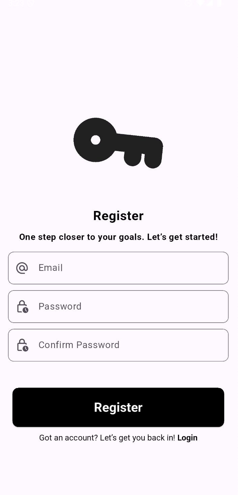
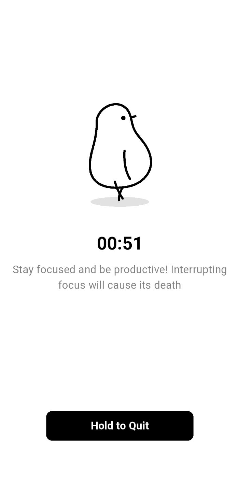
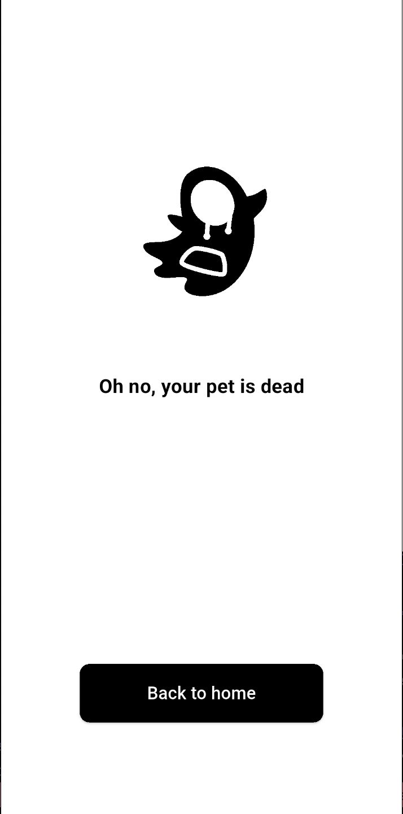
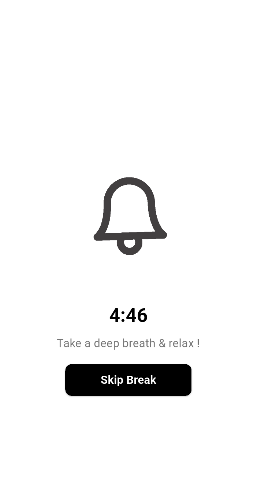
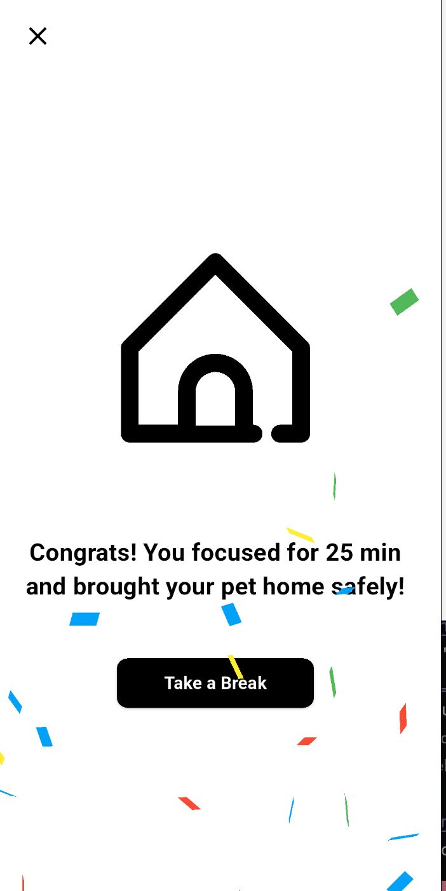

📌 **Hey Focus!**

Timer berbasis teknik Pomodoro yang membantu meningkatkan fokus dan produktivitas. ⏳
Aplikasi ini menerapkan sesi fokus selama 25 menit diikuti dengan 5 menit istirahat, sehingga pengguna dapat bekerja lebih optimal tanpa merasa lelah.

✨ Fitur

🌟 `Sesi Fokus 25 Menit – Meningkatkan produktivitas dengan interval kerja yang optimal.`

⚙️ `Istirahat 5 Menit – Memberikan waktu relaksasi untuk menjaga keseimbangan.`

⏳` Mulai Timer dan Fokus – Pengguna dapat memulai timer dan fokus pada tugas yang ingin dilakukan.`

✋ `Hold to Quit – Opsi untuk menghentikan sesi fokus jika diperlukan.`

🔒 `Lock-in Selama 25 Menit – Jika pengguna berhasil menyelesaikan sesi penuh, mereka akan mendapatkan break selama 5 menit.`

📌 **Dependencies**

1. `flutter` -> Framework utama untuk membangun aplikasi.
2. `get (v4.6.6)` → State management & routing yang simpel dan efisien.
3. `lottie (v3.2.0) → Untuk menampilkan animasi Lottie (file JSON dari After Effects).`
4. `Database & CRUD` (Menyusul)
5. `Firebase 🔥` (Menyusul, kak i promised im working for it)

🛠️ **Dev Dependencies**

1. `flutter_native_splash (v2.4.3)` → Membuat splash screen native saat aplikasi dijalankan.
2. `confetti (v0.7.0)` → Untuk efek confetti di aplikasi.

**Screenshot 📸**

`📝 Halaman Register`  

`🏠 Halaman Utama`  

`🕒 Saat Timer Berjalan`  

`❌ Gagal Fokus `  

`☕ Waktu Istirahat`  

`🎉 Sukses Fokus!`  

